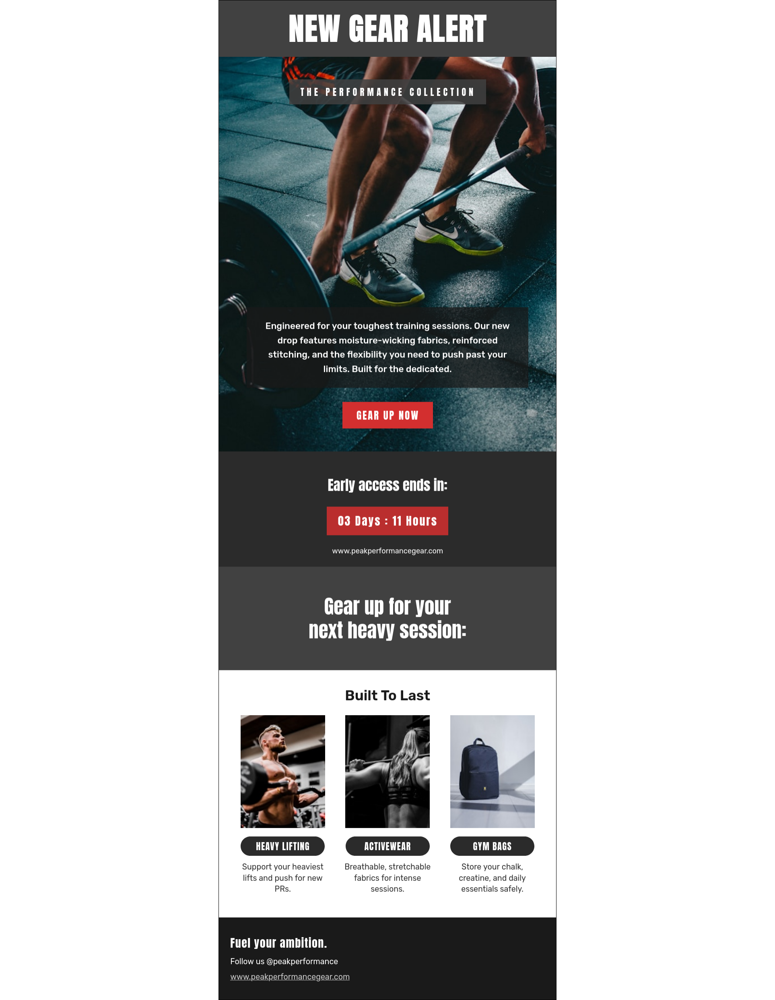

# 🏷️ Professional E-Commerce Product Drop Campaign
### A Responsive HTML Email Template Built for High Compatibility

| Desktop Preview | Mobile Preview |
| :--- | :--- |
|  |  |

## 📖 Project Overview
Email development requires a specialized approach compared to traditional web development. While modern browsers support advanced CSS, many email clients rely on legacy rendering engines that often break standard layouts.

This repository showcases a **production-ready E-Commerce Promotional template**, specifically designed for product drops and marketing campaigns. It utilizes a robust hybrid-fluid architecture to ensure a premium brand experience across all platforms, ensuring your multi-column layouts and hero images look perfect in every inbox.

## 🛠️ Technical Implementation
To achieve maximum reliability and visual consistency, I implemented the following professional development standards:

* **Bulletproof Grid Architecture:** Engineered a 3-column product grid using `display: inline-block` tables with strict `max-width` properties. This allows products to sit side-by-side on desktop clients, while smoothly and safely stacking vertically on mobile screens without relying on complex media queries.
* **Outlook-Safe Spacing & Backgrounds:** Replaced standard CSS margins with strict padding and `&nbsp;` spacer rows to prevent layout collapse in Microsoft Word rendering engines. Implemented standard HTML `bgcolor` fallbacks to ensure readability even if an email client strips out modern CSS `rgba()` transparency.
* **Accessibility Standards:** Applied `role="presentation"` to all layout tables, ensuring that the structural code does not interfere with screen readers or assistive technology.
* **Inlined Styling:** All CSS is applied directly to elements to prevent styling loss in clients like Gmail, which often strip out header-based style blocks.

## 🚀 Platform Integration
The code is modular and clean, making it perfectly suited for integration into major Marketing Automation and CRM platforms, including:
* **Salesforce Marketing Cloud**
* **Mailchimp**
* **ActiveCampaign**
* **HubSpot**

## 📂 Repository Structure
* `index.html`: The core production-ready HTML code.
* `preview.png`: Visual representation of the desktop layout.
* `preview-mobile.png`: Visual representation of the mobile layout.

## 🤝 Contact
**Salah Attar** *Web & Email Developer* Focused on creating high-conversion, accessible, and technically robust digital experiences.
